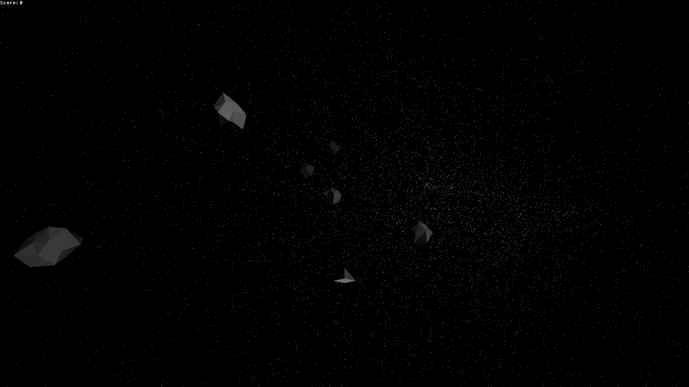

# Comets
Comets is an attempt at making a 3D game based on the 2D game 'Asteroids'.

## Screenshots

## Architecture
- Asteroids are simple 3D models, floating in space. They spawn at some distance from the player and loop around when far enough away from the player, to create a compact but "open" world. (This actually makes the world into a three-torus, which ironically is compact)

## Plan:
It's working decently well now, so I'm not actively working on it, but these are some possible points of improvements.
- More precise ship-asteroid collision check
- Implement a proper sun (visual only, should be drawn out of accessible map)
- Implement newtonian movement (turning doesn't change direction of movement, just of acceleration)
- Add skybox
- Add local score saving
- Add shadows
- Add "dust" particles, the visibility of which is determined by shadows, giving a reverse sunbeam effect left by asteroids

## Libraries

Comets makes use of GLFW, OpenGL, [cglm](https://github.com/recp/cglm) and [glText](https://github.com/vallentin/glText).
